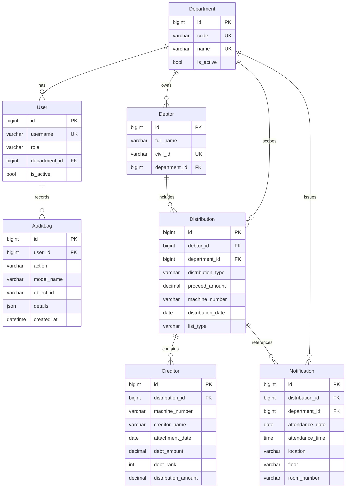

# ERD - نظام قسمة غرماء الديون

## فهارس وقيود أساسية
- Unique: `Department(code,name)`, `Debtor(civil_id)`, `Distribution(department,machine_number)`
- Indexes: البحث على `civil_id`, `machine_number`, `distribution_date`, `department`
- Constraints: تحقق Regex للرقم المدني 12 رقم، والرقم الآلي 9 أرقام وينتهي بصفر.
